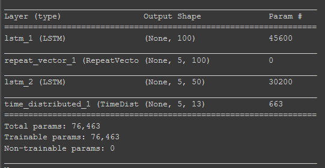
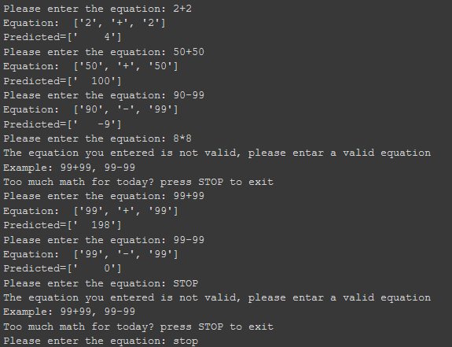

# LSTM_adder
Adding numbers between [-99,99] with an Encoder-Decoder LSTM Recurrent Neural Network

## Introduction

θα αναπτύξουμε ένα μοντέλο LSTM το οποίο θα μπορεί να μοντελοποιήσει την πρόσθεση και την αφαίρεση μεταξύ ακέραιων αριθμών στο διάστημα [-99,99].

## Methods

### random_sum_pairs, random_sub_pairs
Σε αυτή την περίπτωση θα χρειαστεί να δημιουργήσουμε μονοί μας την βάση με τα δεδομένα. Το μόνο που χρειάζεται είναι να δημιουργήσουμε τυχαία παραδείγματα από προσθέσεις και αφαιρέσεις 2 αριθμόν και να αποθηκεύσουμε το αποτέλεσμα. 

### to_string
Τα δεδομένα που θα δεχόμαστε και θα παρουσιάζουμε στην κονσόλα θα είναι σε μορφή αλφαριθμητικού. Όποτε θα πρέπει να βρούμε ένα τρόπο να αναπαραστήσουμε την έξοδο και την είσοδο. Η μεγαλύτερη πράξη που θα δέχεται το μοντέλο είναι το "-99+99" και η μεγαλύτερη έξοδος θα είναι το "-188". Αρα βλέπουμε ότι θέλουμε 6 χαρακτήρες για την είσοδο και 4 χαρακτήρες για την έξοδο. 

#### integer_encode

Οπως αναφέραμε και πιο πάνω τα δεδομένα που θα δεχόμαστε θα είναι σε μορφή αλφαριθμητικού άρα θα πρέπει να φτιάξουμε μια ρουτίνα που θα μετατρέπει τα αλφαριθμητικά σε ακέραιους αριθμούς για το νευρωνικό μας μοντέλο.

#### invert

Τέλος πρέπει να μετατρέψουμε τα κωδικοποιημένα δεδομένα στην αρχική τους μορφή για να μπορέσουμε να καταλάβουμε αν η πρόβλεψη είναι σωστή.

## Model

 

## Results

## Installation

### Environment 

Στο παρόν project θα τρέξουμε το μοντέλο μας στο [Colab](https://medium.com/deep-learning-turkey/google-colab-free-gpu-tutorial-e113627b9f5d) ώστε να εκμεταλλευτούμε την Tesla K80 που παρέχει η Google.

### Code

[Script](https://colab.research.google.com/drive/1jkauwkKHXok0grLneRLPmkmslgW4wvP4?usp=sharing)
